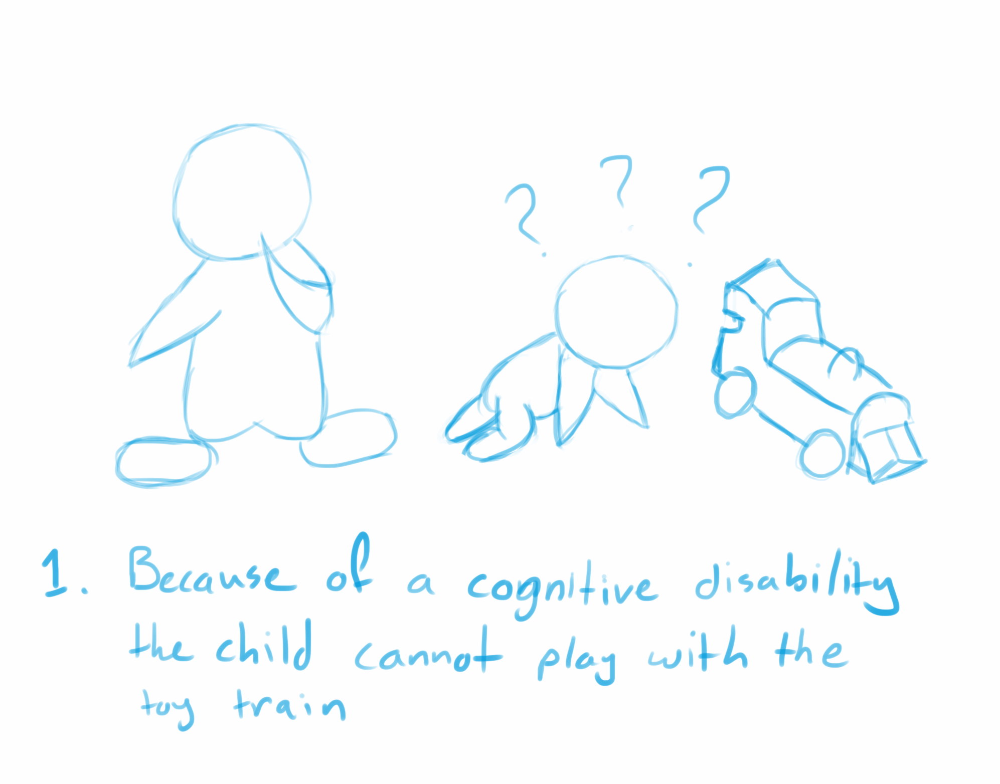
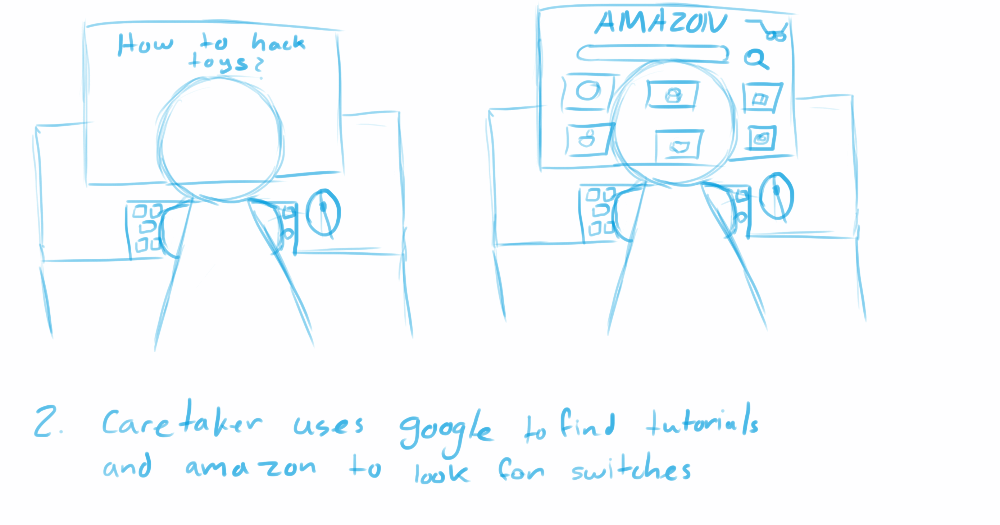
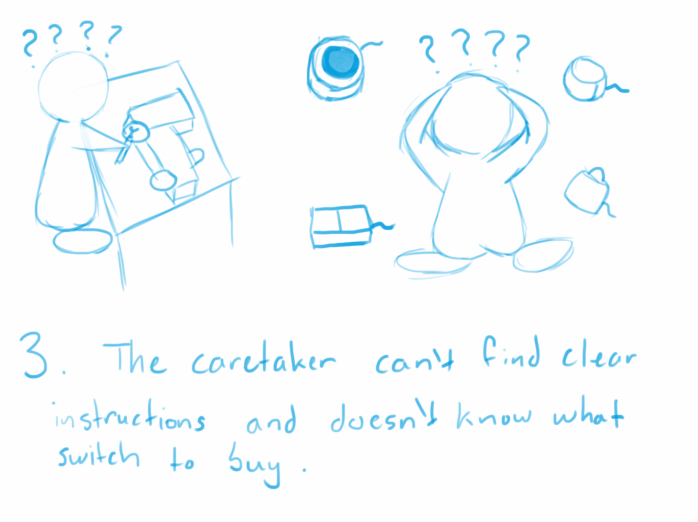
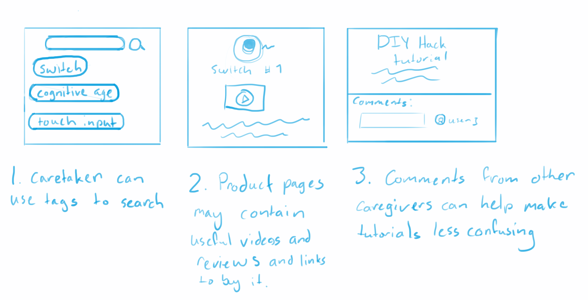

# About
Assistive Tech Lending Library (ATLL)

Affiliation:
University of Washington Paul G. Allen School of Computer Science & Engineering - The Taskar Center for Accessible Technology

Team: Dan Le led1@cs.washington.edu, Sonya Lao solao@cs.washington.edu, Nathan Chen nchen5@cs.washington.edu

References and Stakeholders: 
Anat Caspi (Course Instructor), Gabriel Laigo (PROVAIL Assistive Technologist), Sanath Kumar Ramesh (Parent Stakeholder)
# Project Abstract
Our website is a resource directory compiling information about accessible products like modified toys that are switch accessible, accessible environmental controls, and assistive technology. We aim to bridge the information gap between available assistive tech, product hacking instructions, and general retailer information with detailed accessibility descriptions for all levels of ability. This work is built on top of a paper-based tool developed by Occupation Therapists to help their patients find suitable assistive technologies. 

To view the website hosted at a public url, visit https://assistivetechlib.herokuapp.com/

# Installation
1. To run the application locally, first clone or download the master folder from the Github repository https://github.com/UWcse482a-2020/DNS. 
2. (Optional) To use your own database refer to the MongoDb instructions
3. Download and install nodejs from https://nodejs.org/en/download/
4. Navigate to the DNS folder in the terminal using the command `cd DNS`.
5. Run `npm init` to download the necessary packages for the application
6. Run `npm run start` to start a server on your machine, hosted on localhost port 8081
7. You should see the message “server successfully started on port 8081” returned in the terminal
8. Access the website by accessing `localhost:8081` in your browser

# MongoDb Setup
## Creating a MongoDB Cloud Atlas instance:
1. Follow the documentation provided by MongoDB to create an account, deploy a free tier cluster, and connect to the cluster https://docs.atlas.mongodb.com/getting-started/
2. Create a database to hold the “Tables”/ “Collections” for the site. Then create the Collections used in the database. This can be done via the Atlas web GUI interface, but it is also possible through the mongo shell. If you would like to connect to your cluster through the mongo shell, follow the documentation to download & install the shell on your machine (https://docs.mongodb.com/manual/administration/install-community/) , and how to interact with the shell (https://docs.mongodb.com/manual/mongo/). We used the following schema:
Database name: “AssistiveTechLib”
Collections: Products, Tags, Users
3. To use the database with the code from this project, get the connection url string for the database you just created. Go to backend/connect.js and set const url to that string. You may have to whitelist IP addresses to allow access to the database.
## Uploading a Products csv file to the Products Collection
1. **Ensure that the products csv file follows the same format as our sample-products.csv located on Github.** 
Required columns:

ProductId, Name, Inventory, Image**, Link, Type, Notes, Cognitive-age, sound-off, sound-loud, Moves, lights-off, lights-bright, av-alt, input-small, input-difficult, touch-input, textured, switch-acc, eye-acc, buyable, buy-link, borrowable, borrow-like, makable, make-link

** The Image field should be a valid, permanent reference to the image. If it is a Google Drive link, consider using the backend/imgur.js script to generate an imgur link for the product. If this option is chosen, an additional field will be added to the Products collection called “ImgurLink”
Feel free to add additional feature columns, as they will be added as new fields for each document in the collection. 

From the original CSV stored by Provail, we have removed all duplicate listings and added a ProductId column to uniquely identify all the listings in our database. If your workflow is going to be deleting all elements of the Product database, then reuploading the entire csv file again to make updates to the table, **make sure** to keep the same ProductId column for each product if possible.
2. The actual upload process can be done multiple ways. One option is to use the mongoimport command on the mongoshell (https://docs.atlas.mongodb.com/import/mongoimport/)

Another option is to use the MongoDB Compass GUI, which should come installed on your machine if you have downloaded the mongo shell. In the Compass GUI, enter the connect string to connect to the cluster, then navigate to the AssistiveTechLib database and click on the Products collection, which should be empty. Then, click on the “ADD DATA” green button and choose “Import File”. Browse to the location of your csv file, set the file type to be “CSV” and click on the “Import” button.

## Designating “type” tags and “feature” tags
1. In order for the application to know what tags represent product types and which tags represent features, as well as having human readable versions of each tag, the database will need a Tags table.
2. Import the tags.csv from the github just as described with the products.csv instructions
3. If you wish to add more tags remember to update the Tags table and categories your tags as a product type tag or a feature tag using the “category” field with either “type” or “feature” and specify the tag with the “value” field. If it is a “feature” tag then also a “readable-value” field should be filled to be an understandable version of the tag. For example “{category:”feature”, value:”sound-loud”, readable-value:”Sounds are loud”}
## Creating a User table
Create an empty table called “Users” under the AssistiveTechLib database.
It will be empty but can be populated through the registration page when running the web application.


# About the application
File structure breakdown:
```
project
│   README.md
|
└───sample_csv_files
│   │   sample-products.csv contains the example csv file that should be used as a model for the Products collection in mongodb
│   │   sample-tags.csv contains the example csv file that should be used as a model for the Tags collection in mongodb
└───backend
│   │   server.js contains the express server used to route pages and handle GET requests
│   │   connect.js uses the mongodb nodejs driver to make all of the application's database calls
│   │   imgur.js is a one-time script that is run to generate an imgur link for each product in the database that has a google drive image link
|
└───src
│   │   index.html homepage
│   │   categories.html search results page
│   │   product-page.html individual product page
|   ...
|
└───js
│   │   main.js contains the front end javascript used across all html pages
│   │   buildProductGrid.js dynamically populates the categories.html page based on the user query
│   │   buildProductPage.js dynamically populates the product-page.html page based on the user click
|   ...
|
└───css contains the styling for the website
└───fonts contains the fonts used on the website
└───img contains the locally saved images used on the website
```

 

Image: Homepage of the Assistive Tech Lending Library
# Project Goals
## Goal 1
The platform will help users find products based on certain criteria (a taxonomy). Currently, these products are limited to the selection provided to us through the initial CSV file used as a source of data. However, the selection of products can be added to by future administrators of the project.
## Goal 2
Users should be able to learn accessibility details about a selected product. Accessibility details for each product are currently limited to the fields provided by our original set of CSV data, but future administrators are encouraged to label products with more accessibility information. 
## Goal 3
The user's decision can be informed by other's stakeholder input throughout the platform. The input will be displayed through a reviews section associated with each product. Currently, there are no reviews other than test reviews generated by us (the administrators). However, when this project scales up, normal users will be encouraged to add their own reviews and scale up the funds of information associated with each comments section.
 
 
# Project Development Process
## Tools used:
- Node js
- Html5, CSS3, Javascript, JQuery
- Violet website template from colorlib
- Heroku
- MongoDB

## Use Cases
*Before*: Caregiver is having trouble finding resources for accessible technologies and is mainly using amazon to buy and try out products.






*After*: Caregiver can now find videos of products before purchasing and read reviews given by other people with similar needs. They can also find tutorials and useful links to other resources as well as reading reviews and interacting with other users who have used those products.


 
Flow Diagram

## Database Model
We used MongoDB, a NOSQL database, to store product information, users, and tags. This lets us perform queries on flexible data formats like csvs. 

ProductID
ProductName
Description
Video embed
External link
tags
1
Big Switch
Lorem ipsum dolor sit amet
<html stuff>
www.testlink.com
switch, etc

In addition, we will have separate tables for categorizing tags and other product information so that the original database will remain untouched while mappings can be reorganized manually. 
Tag
Type of tag
switch
category
lights-bright
feature

Finally, we will have a 3rd table for user information and profiles. We can also encrypt passwords using MongoDB to provide extra security.

UserId
password
email
tags
test_user
3ncrypt3d
test_user@test.com
Touch_input, voice_interface, etc

## Backend Process
Our website is built on a MVC framework (model, view, controller) which is considered good architecture. The view is the front end and behind each page is some javascript code that responds to user input which then calls the backend model. By designing the website this way, the backend works like a blackbox that the front end doesn’t need to worry about how it is implemented. This makes it easy to use existing backend methods on future pages or add backend functions and give more functionality without breaking the front end. All of our website’s backend functionalities (ranging from dynamic product pages, searching, and user profiles) are all accessed through a REST API. This allows us to make calls to MongoDb from the backend, preventing users from maliciously making queries that could make harmful changes to the database. We used the node.js mongodb search implementation to access the database with JSON formatted queries. 

# Constraints and Limitations
The primary constraint for the development of the ATLL was time: the University of Washington operates on a 10-week quarter system. We spent approximately 4 weeks designing the project and 6 weeks implementing the library itself. 

All team members were also unfamiliar with the assistive tech space and had to spend some time speaking with needs-experts in order to better understand issues faced by the community, alternate solutions to our project that currently exist, and our own positionality in undertaking this project in collaboration with assistive tech stakeholders.
Moreover, this project was undertaken with just 3 team members with limited design experience and varying degrees of familiarity with full-stack web development. 
Finally, because our project is completely unfunded, we are not paying for premium hosting and the site may be unable to handle the high amounts of traffic for which it is designed. 
User Tests and  Results 
For definition of Goals, see “Goals” section above.
GOAL #1
Task
First, we will ask the user to start at the home page and complete a search. At this stage, we can observe whether or not the usage of our search and tagging interface is intuitive and clear to users. Then, for each clicked-on product, we will ask if: 
This product satisfied the parameters of my query 
This product did not satisfy the parameters of my query 
Additionally, we will ask the follow up question: “Are there any not-provided search tags you would like to add to the search interface: __________ [fill in the blank]”
Data
On average, our users spent 8-10 minutes on this task.


Fill In the Blank Responses
Feature tags should be more descriptive and clear in their wording 
An “age range” tag would be useful
Not all tags apply for all product types
“Eye-acc” looks a lot like AAC, consider writing out the full word “accessibility”
Additional tags: vibration, size, carryable vs. not carryable, requires outlet?, requires fine motor dexterity?, resistant vs not resistant, level of motor movement needed?
Separate category filter for cognitive age
For the “texture” tag, maybe distinguish between soft plush texture vs plastic
Resulting Actions Taken
From Goal 1, we learned that the wording of our search tags was confusing and not descriptive enough for some users. As such, we updated the wording to be clearer by changing the strings associated with each tag when we display the search bar in HTML. 
There was also an overall influx of suggested new tags to add to the search interface for more complex searches. Based on Anat’s feedback, we moved forward with adding text-based keyword searching on the product description column to further improve the granularity of the search experience. We also considered adding an additional dropdown to filter by the cognitive age required to use each product. Ultimately, we did not add the search-by-age feature because the associated data was subjectively filled in by us for testing purposes, and was therefore not highly reliable as the basis for an entirely new dropdown. 
GOAL #2
Task
Next, we asked users to view product pages based on their query. After viewing each product page, they answered the following question(s):
“Based on the information provided on the page, this product is: 
Accessible to me based on my needs
Inaccessible to me based on my needs
I cannot tell because some information is missing 
If previous answer was c), the information missing was as follows: _____ [fill in the blank]”
Data
On average, our users spent 3 minutes reading each product page


“C” Fill in the Blank Responses:
Product make/material/dimensions information 
If the products make noise or are speech compatible, what languages are supported?
Operating and usage instructions 
Resulting Actions Taken
Our product pages at the time did not feature substantive information regarding each product’s technical specifications, such as the material they’re made of, their dimensions, etc. As such, we added a new section to the product page titled “Product Technical Specifications” and inserted a temporary notice stating “Coming Soon - Thank You For Your Patience!” as that information was not actually provided to us through the CSV data. However, this notice will indicate to future developers that such information is a necessary addition.
GOAL #3
Question
More reviews read on a specific product page will increase the user’s confidence in making a decision about the product.
Task
In order to test the utility of user reviews, we asked testers to view three different products and complete the three following metrics:
Likert Scale asking how confident the user is in making a decision about a product before reading the reviews
Likert Scale asking how confident the user is in making a decision about a product after reading the reviews
Likert scales: “Not Confident,” “Somewhat Not Confident,” “Neither Confident Or Unconfident,” “Somewhat Confident,” “Very Confident” 
Our three products featured 0 reviews, 3 good reviews, and 6 reviews (3 good 3 bad) respectively.
Data
On average, our users spent 15 minutes to complete the entire task


Resulting Actions Taken
The main improvement that we can implemented for the review section was to make the review section more visible. We added a hyperlink at the top of the product page that that encourages users to leave reviews, redirecting the user screen to the review section for easy access upon being clicked.
GENERAL ADDITIONS AND BUGFIXES
At the time of user testing, we encountered a bug with the Facebook comments plugin that prevented the comment section from being dynamically loaded on the public-facing URL. We fixed this bug by dynamically loading the plugin directly in product page HTML file, rather than through a script loaded in through a separate file.
Testers found the language in the “user preferences / taxonomy” form to be slightly confusing. We simply changed the text in the form to be more specific. We also added a way for users to change their preferences, and to logout of their accounts.
Some testers indicated that they would like to learn more information about the library’s mission and how to contact the organizers of the site. We added new “About” and “Contact Us” pages filled with relevant static information, and hooked them up to the navigation bar in the website’s header.
Finally, some tab-able elements were redundant, such as containers that are highlight-able even when their individual elements are also highlight-able. These elements could have been misleading to users who think they can interact/click on them even when they can’t. We solved this issue by removing certain element tags from extraneous elements to take away their highlight-ability. 
Conclusion and Future Directions
There are a couple of features we would like to add had we not been constrained. 
For the search bar, we would have liked to offer a more granular tag system. Compared to sites like EnablingDevices.com, our tags are not as specific or varied. We would also have liked to add cognitive age as a search parameter if we had time. Finally, it would be useful to have the ability to negate features, which we do not currently support.
For each product page, we would have wanted to also include a “rating” system on a 5-point or 5-star scale. Paired with the reviews section, this could provide even more user-generated opinions for each product. For each product, we also wanted to have a “wishlist” button, where any registered user could save product links to a list in order to have them easily-accessible.
Moving forward, we would also like to further refine the information provided on profiles and making the preferences-selecting form even smoother. 
Finally, it would be a nice addition to have more pictures on the homepage to add some personality, as well as include more product videos to make product pages more informative.
User Guide
Search 
To begin (or re-start) a search, navigate to the home page by clicking on the Logo on the top-left hand corner of the screen, or on the Home page tab in the header. 
Search by Tags 
Adding tags
Select 0, 1, or many Product Type tags from the dropdown menu titled “Product Type.” 
Select 0 or many Product Feature tags from the dropdown menu titled “Features”. 
Add any keywords to search on to the search bar text input
Removing tags
To remove a tag, view the list of currently applied tags directly below the Product Type and Feature dropdown menus. Press the “x” on the same horizontal row as each tag (demarcated by bullet points) to remove the tag. 
Search 
To perform a search, click the Search button that is located to the right of the Search Bar text input field 
Search by Search Query 
Input a phrase to search on in the Search Bar and click the Search button to run a search
Error State: Unsuccessful Search 
If a search bears no results, the user will encounter an error message stating “No matching products were found. Please try a different search.” For example, a search by tags for “Adapter” and “sound-off” will return no results. 
Click the Search Again button from the error state to attempt another search, or restart the search directly by choosing new tags at the search section located at the top of the page.
Browse 
Browse all products
Perform a tag-less search by clicking on the search button without any tags, or click the Browse tab in the header at any point. 
Browse by product category 
Hover over the Browse tab in the header, and click one of the categories that appears in the dropdown menu. 
Browse page navigation 
View the products that match your browse criteria by scrolling up and down the page. 
Visit the individual Product Page for a product by clicking on the image or the title of the product.
Perform another search
Generate another search by following the same steps to use the search bar located at the top of the Browse page
Product Page
Viewing product information
Scroll up and down the page; description and features are at the top of the page and under Product Features, respectively. 
Following external links to product suppliers 
In the middle of the page, notice 3 different buttons. The availability of links to Purchase/Borrow/Make instructions is detailed above each respective button. If the button is green (can be hovered over and displays a mouse hand when doing so, focused on, doesn’t display a crossed out symbol when hovered on), a link can be followed by clicking the button. 
Leaving a comment 
Enter your review by typing into the text box under User Reviews. If not logged in to Facebook, press the Login to post button to Login to your Facebook account. If you are logged in, Press Post to add your comment to the page. *Adding a review requires a Facebook account. You must login before posting a review. 
Viewing Video
If a video is available, it will be displayed right underneath the product image. Click on the play button on the video player to view the video.
About
View About Information
View our “About” information by clicking on the “About” tab in the header of any page on the site. 
Contact Us
View Contact Information
View our “Contact Us” information by clicking on the “Contact Us” tab in the header of any page on the site. 
Register/Login 
Register 
Start registration by clicking the Register tab in the header. 
Fill in desired username, email, and password information. Click Submit once finished filling in information.
Error state: If information is not improperly inputted, notice will pop up asking a user to “Please fill out this field.
Successful registration will take the user to the Customize Profile page with notice stating “Registered Successfully. ” 
Customize Profile
Scroll up and down the page and click on 0 or many check boxes that match desired product features and preferences, then click the Submit button
Successful form completion will take the user back to the Home page with a personalized message, and the user tags pre-filled underneath the search bar area
Sign In 
Enter username and password into the corresponding fields. Click Submit once finished filling in information.
Error state: If information is not improperly inputted, notice will pop up asking a user to “Please fill out this field.
Successful sign in will take the user back to the Home page with a personalized message. 
Profile
View Profile
To view the profile, click the Profile tab in the header. 
Note that Profile tab will be unavailable unless signed in.
View your Profile preferences and modify the checkboxes that are selected if desired
When complete, click on the Update Profile button to save your changes
Log Out
When signed in, there will be a Log Out link as the right-most clickable option of the menu bar. To log out of your account, click on the Log Out link
The user will be redirected to a “Logging Out…” screen before being redirected to the home page
